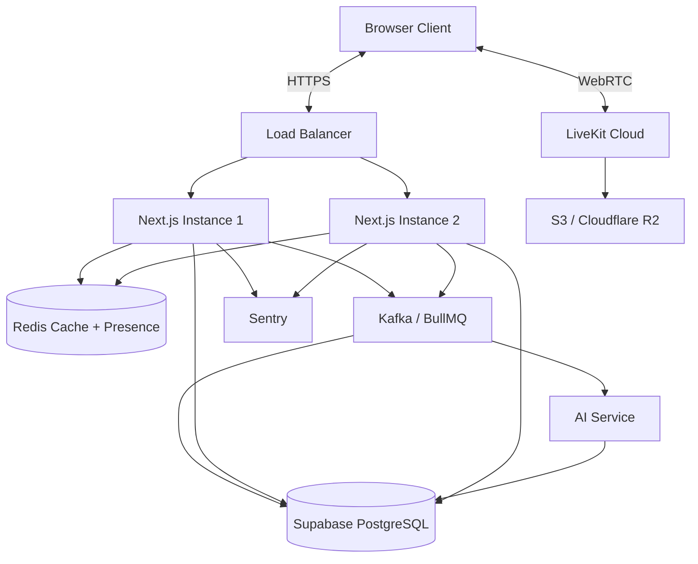

# Lumen v2.0 Architecture

Lumen v2.0 is a secure, real-time video support platform designed to provide support agents and customers with seamless communication channels including video, voice, screen sharing, and persistent chat.

## System Architecture

The application uses a modern Next.js App Router architecture integrated with LiveKit for WebRTC media routing.

## Security Model

1. **Role-Based Access Control (RBAC):**
   - The platform defines three roles: `CUSTOMER`, `AGENT`, and `ADMIN`.
   - Role assignment is strictly enforced on the server. The registration route ignores client-provided roles and only assigns `AGENT` if a valid `AGENT_INVITE_CODE` is provided.

2. **LiveKit Token Generation:**
   - Previous vulnerabilities trusted URL query parameters (e.g. `isAgent=true`). This has been removed.
   - The `/api/livekit/token` route now enforces agent validation by cross-referencing the authenticated `session.user.id` against the `agentId` of the requested meeting record in the database.
   - Only authorized agents receive `roomAdmin` and `roomRecord` grants within LiveKit.

3. **Input Validation:**
   - All REST API endpoints use `Zod` schemas to strictly validate payloads (e.g., stripping spaces from Meeting IDs, enforcing password complexity).

4. **Secrets Management:**
   - Environment variables have been extracted to `.env.local` which is securely gitignored.

## Data Models

The Prisma schema defines the core business entities:
- **Meeting:** Represents a support session, capturing status (`WAITING`, `ACTIVE`, `ENDED`, `FAILED`), meeting ID, and passcode.
- **Message:** Persists chat communication within a session.
- **SessionEvent:** Tracks the session timeline (e.g., participants joining/leaving, recordings started/stopped).
- **Recording:** Stores metadata about recorded media.
- **Attachment:** Tracks files shared within the chat.

## Real-Time Subsystem

- **Video/Audio/Screen:** Handled exclusively via LiveKit SDK.
- **Dashboard Updates:** The traditional polling mechanism has been replaced with a Server-Sent Events (SSE) endpoint (`/api/sessions/stream`). This pushes state updates to the dashboard instantly while reducing server load.
- **Reconnect Handling:** The LiveKit room configuration implements a 60-second grace period for network drops, preventing immediate ejection.

## Observability

1. **Structured Logging:** All console logs are replaced with a centralized structured JSON logger (`lib/logger.ts`) for easier ingestion into log aggregation tools.
2. **Prometheus Metrics:** The `/api/metrics` endpoint exposes runtime metrics (active sessions, session durations, total users) in Prometheus format.
3. **Sentry:** Pre-configured scaffolding catches client, server, and edge errors.
